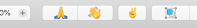

# sketch-toolbar-item
A boilerplate/demo plugin for adding a toolbar icon in Sketch

### How to use
1. Copy the SketchToolbarIcon.framework bundle into your plugin's Resources folder
2. Register your toolbar icons in the Startup handler
3. Read the comments in `script.js` for detailed explanation

### Important:
1. Please set a unique identifier for your plugin in your manifest. It's required to identify your plugin and avoid conflicts with other plugins.
2. This demo includes the ability to validate toolbar icons on selection change. Please use this sparingly since doing too much in the handler will make Sketch crawl.

---

Do create an issue here if you find any weirdness.
